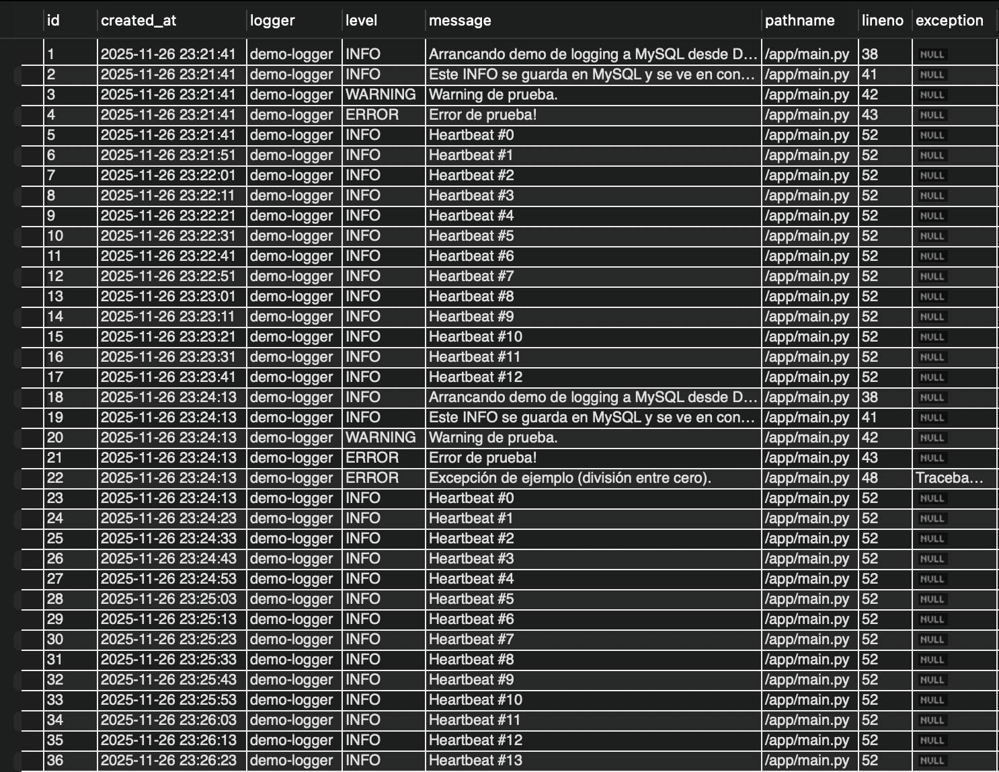

# Logging Demo – Python + Docker + MySQL

Este proyecto es una guía completa y práctica para aprender a usar el módulo **logging** de Python escribiendo logs en una base de datos **MySQL**, dentro de un entorno totalmente dockerizado mediante **Docker** y **Docker Compose**.  

El objetivo es mostrar cómo construir un servicio Python que:
- Escribe logs en consola
- Escribe logs en una base de datos MySQL
- Usa un handler personalizado (`MySQLHandler`)
- Se ejecuta en contenedores reproducibles

El proyecto está diseñado para ser clonado y ejecutado inmediatamente sin instalar Python ni MySQL localmente.

---

# 1. Requisitos previos

Antes de ejecutar este proyecto debes tener instalado:

## 1.1 Docker
Descargar desde:  
https://www.docker.com/products/docker-desktop  

Verificar instalación:

```bash
docker --version
```

# 2. Ejecución
```bash
docker compose up --build
```
# 3 Crear conexión en MySQL Workbench

En **MySQL Workbench**, crea una conexión nueva con estos valores:

| Campo            | Valor           |
|------------------|-----------------|
| Connection Name  | logging-demo-db |
| Hostname         | 127.0.0.1       |
| Port             | 3307            |
| Username         | appuser         |
| Password         | apppass         |
| Default Schema   | logging_demo    |


# Select en MySQL Workbench
